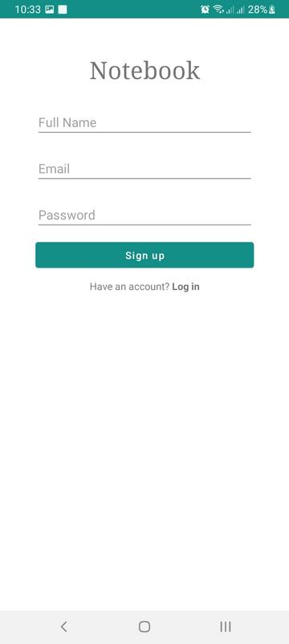
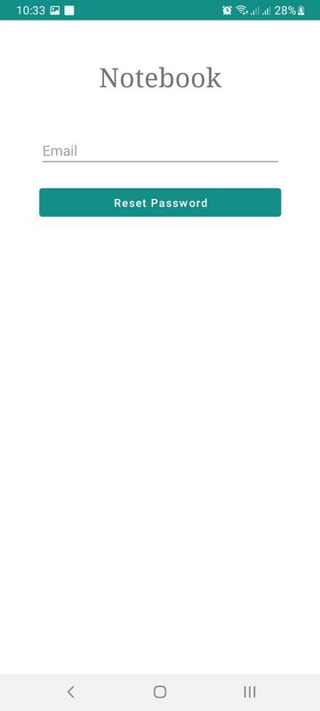
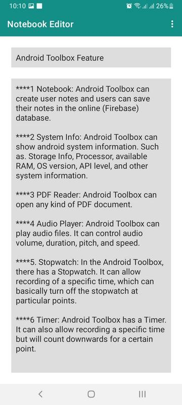
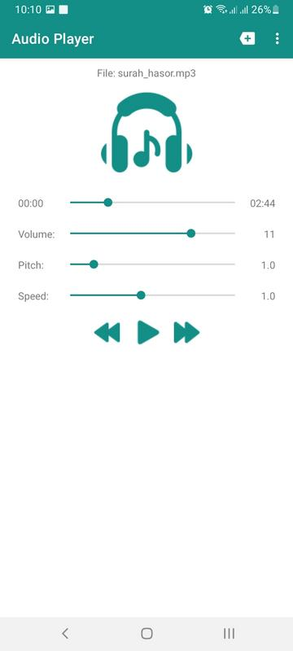

# Android Toolbox

## Introduction
Android Toolbox is a versatile Android application designed to provide users with a range of functionalities, including system information checking, audio and PDF file handling, stopwatch and timer features, and a text editor for creating notebooks.

## Design Goals/Objective
The primary objectives of the Android Toolbox project include:

- Understanding the concept of developing an Android application.
- Offering diverse functionalities within a single installation.
- Providing system information checks.
- Supporting audio and PDF file handling.
- Implementing a stopwatch and timer.
- Creating a user-friendly text editor for notebooks.
****
## Design/Development/Implementation of the Project

### Design
The Android Toolbox is built using Java programming language and the Android Studio IDE. The graphical user interface (GUI) is designed in XML for a user-friendly experience. Key features include:

1. **Notebook:** Create, save, and sync notes with an online (Firebase) database.
2. **System Info:** Display various Android system information.
3. **PDF Reader:** Open and view PDF documents.
4. **Audio Player:** Play audio files with control over volume, duration, pitch, and speed.
5. **Stopwatch and Timer:** Record and manage time easily.

### Implementation
The code is implemented in Android Studio, with Java files handling various functionalities and XML files defining the layout. Key files include:

- `AudioPlayerActivity.java`
- `SystemInfoActivity.java`
- `Timer.java`
- `MainActivity.java`
- `NotebookResetPassword.java`
- `PDFReader.java`
- `Notebook.java`
- `NotebookSignUp.java`
- `Stopwatch.java`

## Performance Evaluation

### Simulation Environment/Simulation Procedure
The Android Toolbox project met its goals during testing in the Android Studio environment, with the code functioning as expected.

### Results and Discussions
Screenshots of the Android Toolbox in action:

### Limitations
There are some limitations users may face, including:
- Picture-in-picture (PiP) mode limitations on older Android versions.
- Text selection issues in PDFReader.
- Audio pitch and speed restrictions on certain Android versions.
- Stopwatch displaying limitations.

## Conclusion

### Introduction
The Android Toolbox project provided valuable experience in Java programming and GUI implementation, along with Firebase database integration.

### Practical Implications
Android Toolbox offers practical benefits, and future plans include enhancing security, improving PDF Reader, and additional features.

### Scope of Future Work
Future work involves encrypting user notes, improving PDF Reader functionality, and enabling the saving/exporting of audio files.

## References
1. [Android PDF Viewer - GitHub](https://github.com/barteksc/AndroidPdfViewer)
2. [Firebase - Get Started with Firebase](https://firebase.google.com/docs/auth/android/start)
3. [Android Developers - Application Fundamentals](https://developer.android.com/guide/components/fundamentals)
4. [Android Developer - Build](https://developer.android.com/reference/android/os/Build)
5. [Stack Overflow - How to enable night mode programmatically?](https://stackoverflow.com/questions/47495534/how-to-enable-night-mode-programmatically)
